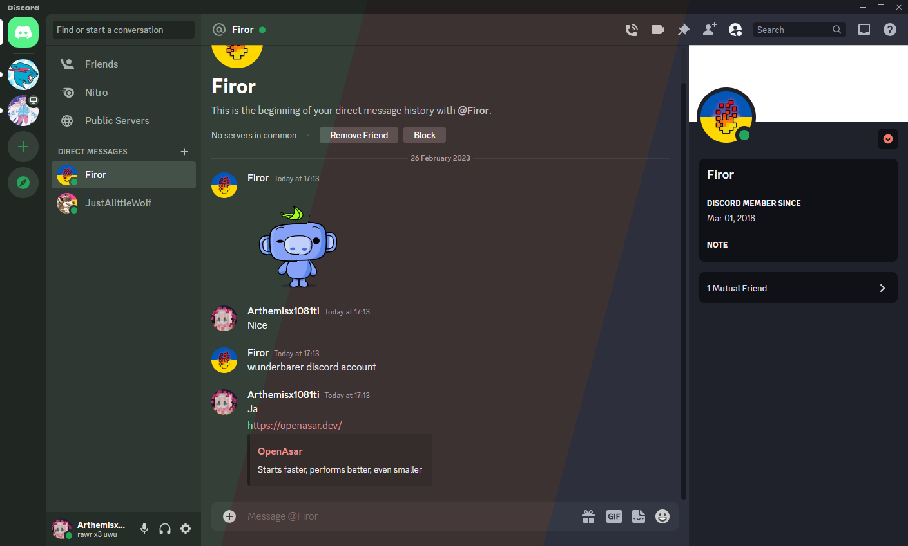
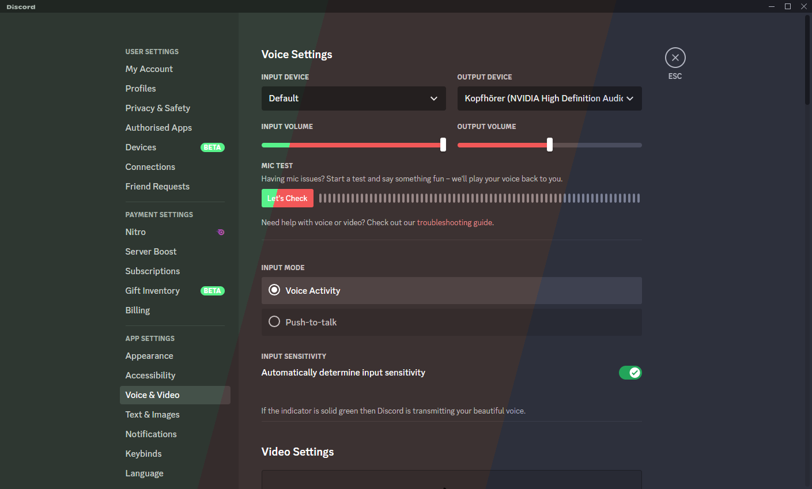

<h1>Material You Discord Colors</h1>

Change Discord's colors to match your favourite color theme

### Installation

#### Openasar

Copy and paste the contents of [MaterialYouColors.theme.css](https://github.com/JustAlittleWolf/Material-You-Discord-Theme/blob/main/MaterialYouColors.theme.css) into Theming

#### Better Discord

Download the latest [Release](https://github.com/JustAlittleWolf/Material-You-Discord-Theme/releases/download/1.0.0/MaterialYouColors.theme.css) and drop it into your Themes folder

### Customization

In the main css file you will find some variables that you can change to match your desired color theme perfectly

* `--myc-background-hue`: specify which color will be used for the background. It is set to 0 by default which is Red. You can find the Hue of your favourite color by going to [htmlcolorcodes](https://htmlcolorcodes.com/color-picker/), selecting your color and copying the value next to "H".
* `--myc-background-saturation`: change how saturated the background color will be. A lower value will result in a more gray-ish image. If you are using light mode, you probably need to increase this value by a lot.
* `--myc-background-lightness`: change how bright the background color will be.
* `--myc-link-lightness`: change how brightly links are displayed. You probably need to lower this value a bit if you are using light mode.
* `--myc-ui-lightness`: change how bright the Discord logo and some buttons are. With bright colors like yellow reducing this value improves readability in the settings page.

### Preview

Change Discord to any color you want

Everything is themed uniformly

Light mode works as well

